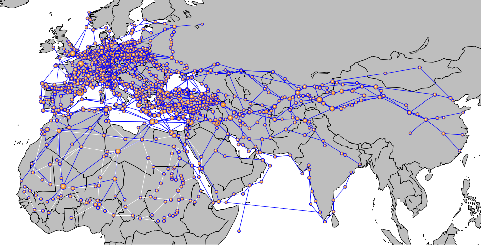

# Modeling Mortality and Transmission of the Black Plague
Adam Novotny, Apurva Raman

## Abstract:
Gómez and Verdú model the infection patterns of the Black Death pandemic in their 2017 paper “Network theory may explain the vulnerability of medieval human settlements to the Black Death pandemic”. They construct a historically accurate network representing Europe and Asia using the OWTRAD dataset, which contains information about medieval cities and the trade and pilgrimage routes between them. They find that hub cities are prone to being reinfected more often. We replicate this experiment and add an SIR model in each city to investigate how mortality affects transmission of the disease through the network. We find TODO: result here (the disease to spreads through the network and total mortality is affected by x, y, z).

## Replication
Gómez and Verdú construct a historically accurate network representing Europe and Asia using the OWTRAD dataset, which contains information about medieval cities and the trade and pilgrimage routes between them. They start the plague in a city in Asia, representing a city’s infection state as a binary state, and then let the plague propagate through the network with a given transmission chance. As expected, they find that hub cities get reinfected repeatedly. They find that cities with high mortality (as reported in historical accounts) were cities with high centrality on the network. From this, they conclude that reinfection from neighboring cities is a possible mechanism for higher mortality rates.

We replicate this network using the datasets Gómez and Verdú list. Our network is different, particularly with respect to degree centrality and degree. We have 259 extra nodes present in our network, which indicates that our data is different despite using data Gómez and Verdú list in their supplement from the same source.

#### Table of network characteristics (vs Gomez and Verdu):
| Characteristic | Our Network’s Value | Reported Value |
| --- | --- | --- |
| Number of Nodes | 1570 | 1311
| Number of Edges | 2069 | 2084
| Mean Degree | 2.63 | 3.18
| Mean Degree Trade | 2.05 | 2.49
| Mean Degree Pilgrimage| 0.59 |  0.69
| Transitivity | 0.065 | 0.098 |
| Degree Centrality | 0.0016 |  |
| Closeness Centrality | 0.072 | 26.92 ±​  12.90 |

We run the simulation of infection to identify if a relationship between hub cities and amount of reinfection is present.

## Modeling Mortality

[scatter (box?) plot/pmf of degree/closeness/centrality and reinfection rate?]
(caption explaining relationship).

Figure [x] reinfection rate vs degree. Cities with higher degree have {higher reinfection rates}.

Figure

This model simulates transmission between each city, but does not simulate a city’s population becoming infected or dying. Gómez and Verdú suggest that there may be some relationship between reinfection and mortality, but do not model mortality directly.

We extend the model to simulate mortality by adding an SIR model to each city where the recovered state represents mortality. We give each city a population of 250 at the start of the simulation. At each timestep, susceptible residents may become infected with probability determined by the infection rate and number of infected residents, and infected residents may die with a probability determined by the mortality rate and the number of infected residents. A city with infected residents may also transmit the disease to another city with probability determined by transmission rate and number of infected citizens.

We plot the SIR metrics for one of the cities in the network given an infection rate of 0.2, a mortality rate of 0.2, and a transmission rate of 0.1.

Figure: SIR one city

The number of susceptible residents decreases as infected residents increases, and infection slows down as more people die. The death rate slows when about half of the population dies.

This indicates the SIR model is working as expected; the population transitions from state to state, and when mortality and infection rates are equal, mortality is limiting transmission.
