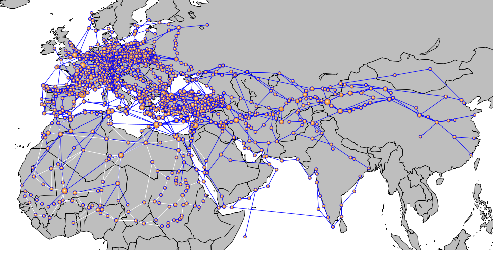
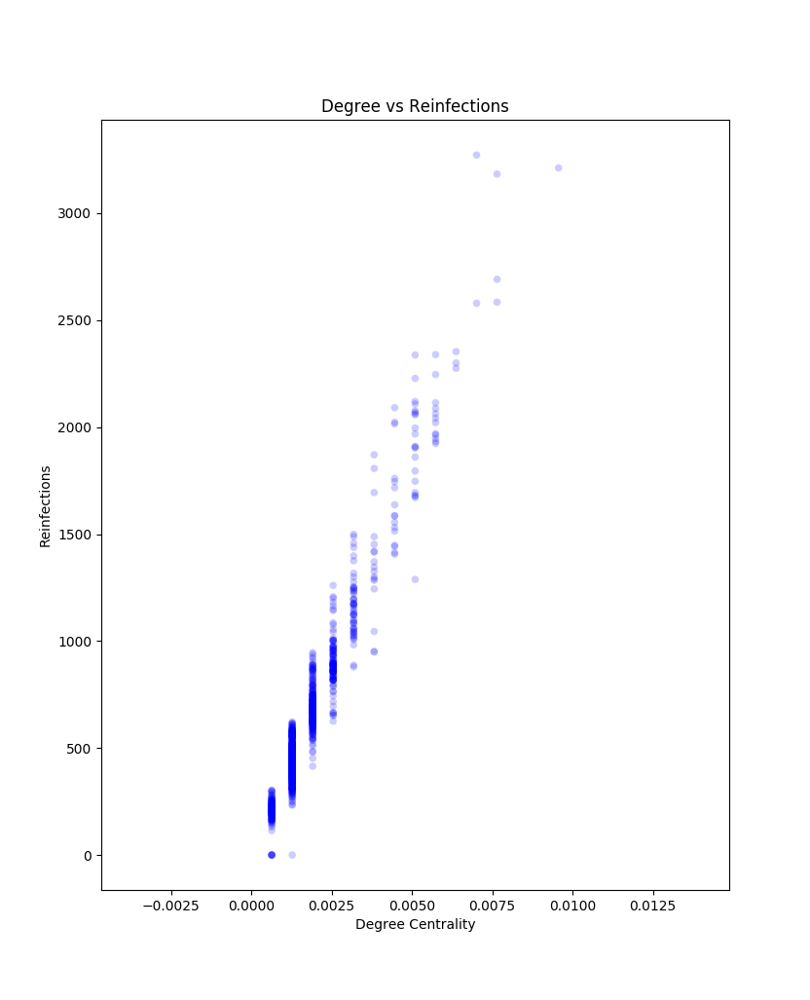
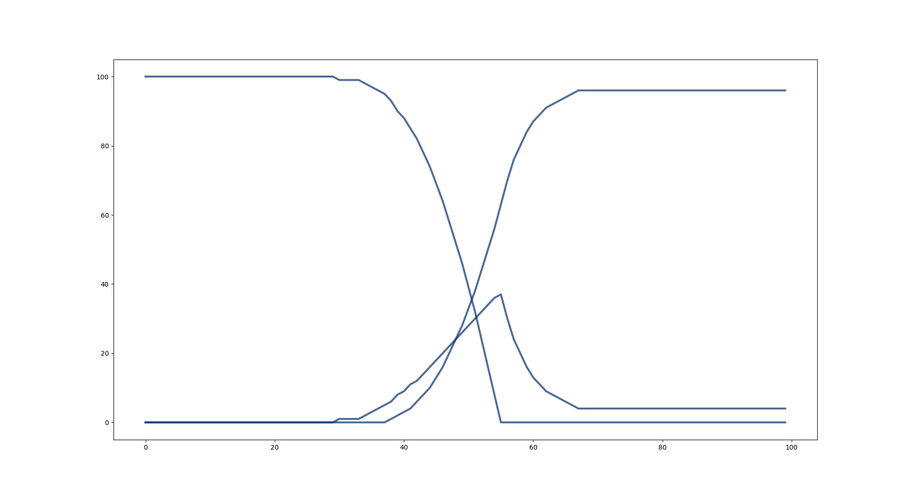
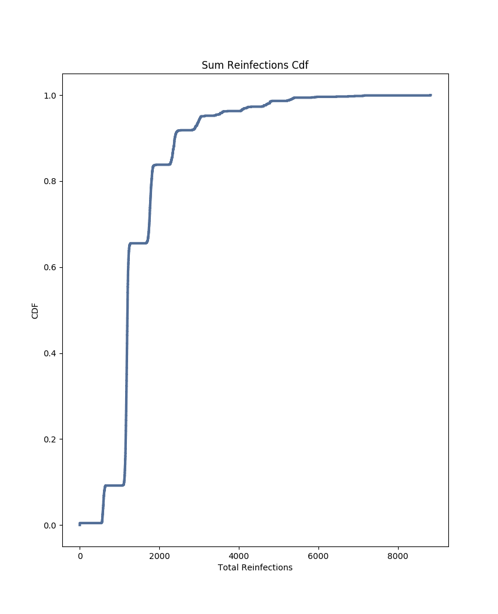

# Modeling Mortality and Transmission of the Black Plague
Adam Novotny, Apurva Raman

## Abstract:
Gómez and Verdú model the infection patterns of the Black Death pandemic in their 2017 paper “Network theory may explain the vulnerability of medieval human settlements to the Black Death pandemic”. They construct a historically accurate network representing Europe and Asia using the OWTRAD dataset, which contains information about medieval cities and the trade and pilgrimage routes between them. They find that hub cities are prone to being reinfected more often. We replicate this experiment and add an SIR model in each city to investigate how mortality affects transmission of the disease through the network. We find TODO: result here (the disease to spreads through the network and total mortality is affected by x, y, z).

## Replication
Gómez and Verdú construct a historically accurate network representing Europe and Asia using the OWTRAD dataset, which contains information about medieval cities and the trade and pilgrimage routes between them. They start the plague in a city in Asia, representing a city’s infection state as a binary state, and then let the plague propagate through the network with a given transmission chance. In their network, hub cities get reinfected repeatedly. They find that cities with high mortality (as reported in historical accounts) were cities with high centrality on the network. From this, they conclude that reinfection from neighboring cities is a possible mechanism for higher mortality rates.

"Figure 1: A geographical representation of the network. Created by Gómez and Verdú"

We attempt to replicate the network from the datasets that Gómez and Verdú list in their supplement. Our network is different, particularly with respect the number of nodes and mean degree. We have 259 extra nodes present in our network, which indicates that our data is different despite being created from the same files. As they had manually crafted their dataset from 23 files, we cannot identify where the mismatch occurs.

#### Table of network characteristics (vs Gomez and Verdu):
| Characteristic | Our Network’s Value | Reported Value |
| --- | --- | --- |
| Number of Nodes | 1570 | 1311
| Number of Edges | 2069 | 2084
| Mean Degree | 2.63 | 3.18
| Mean Degree Trade | 2.05 | 2.49
| Mean Degree Pilgrimage| 0.59 |  0.69
| Transitivity | 0.065 | 0.098 |

## Modeling Mortality
Their model simulates transmission between each city, but does not simulate a city’s population becoming infected or dying. Gómez and Verdú suggest that there may be some relationship between reinfection and mortality, but do not model mortality directly.

We extend the model to simulate mortality by adding an SIR model to each city where the recovered state represents mortality. We give each city a population of 250 at the start of the simulation. At each timestep, the tally of susceptible, infected, and dead residents is updated based on their respective probabilities and the number of infected people. A city with infected residents may also transmit the disease to another city with a probability determined by transmission rate and the number of infected citizens.

We run the simulation of infection to identify if a relationship between hub cities and amount of reinfection is present.

"Figure 2: Reinfections vs Degree Centrality"

Figure 2 shows the relationship between degree centrality and number of reinfections. Reinfections appear to increase proportionally with degree centrality.

Despite the differences between the networks, Figure 2 shows that hub cities get reinfected more often in our model as well.

"Figure 3: SIR in one city"

We plot the SIR metrics for one of the cities in the network given an infection rate of 0.1, a mortality rate of 0.1, and a transmission rate of 0.05.

The number of susceptible residents decreases as infected residents increases, and infection slows down as more people die. The death rate slows when about half of the population dies.

This indicates the SIR model is working as expected; the population transitions from state to state, and when mortality and infection rates are equal, mortality is limiting transmission.

"Figure 4: Sum of Reinfections CDF"

Figure 4 shows the distribution of the number of reinfections. there is a steep jump around 1500, which is something we are investigating.

Our next step is to sweep the three parameters, and analyze the data we extract from that.
