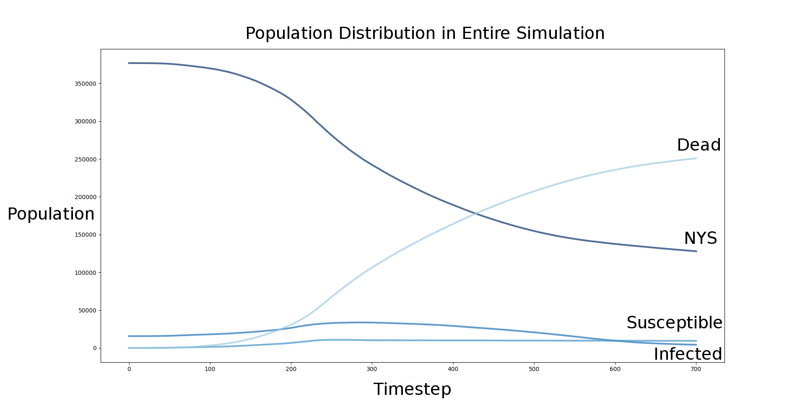
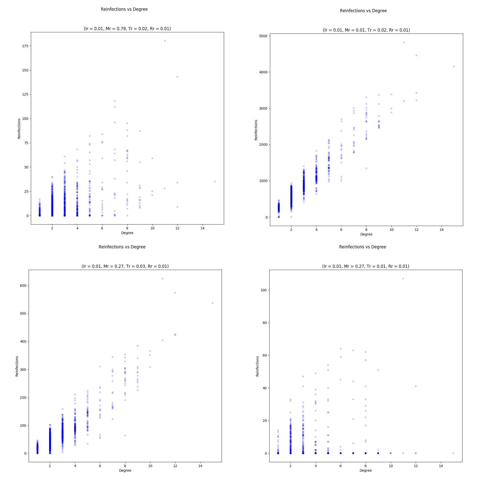

# Modeling Mortality and Transmission of the Black Plague
Adam Novotny, Apurva Raman


## Abstract:
Gómez and Verdú model the infection patterns of the Black Death pandemic in their 2017 paper “Network theory may explain the vulnerability of medieval human settlements to the Black Death pandemic”. They construct a historically accurate network representing Europe and part of Asia and Africa using the [OWTRAD (Old World Trade Routes) dataset][1], which contains information about medieval cities and the trade routes connecting them. They find that hub cities are prone to being reinfected more often, and propose this could be a contributor to higher mortality based on historical data. We replicate this experiment and add a modified SIR model in each city to investigate how mortality affects transmission of the disease through the network, and if the relationship between centrality and reinfection is preserved. We find mortality, infection, and transmission rates that allow the disease to spread through the network while producing reasonable mortality numbers. Regardless of the rates we choose, a city with higher centrality gets reinfected more often.

## Replication
Gómez and Verdú construct a historically accurate network representing Europe and part of Asia and Africa using the OWTRAD (Old World Trade Routes) dataset. They infect a city in Central Asia, representing a city’s infection state as a binary state, and then let the plague propagate through the network with a given probability of transmission. In their model, hub cities get reinfected repeatedly. They find that cities with high mortality (as reported in historical accounts) are cities with high centrality on the network. From this, they conclude that repeated infection from neighboring cities is a possible mechanism for higher mortality rates. They propose that “[t]he overall mortality rate will be the cumulative outcome of partial mortalities caused by each infection wave…[and] a city invaded multiple times could receive different pathogen strains.”


Figure 1: A geographical representation of the network. Created by Gómez and Verdú.

We attempt to replicate the network from the datasets that Gómez and Verdú list in their supplement. Our network is different, particularly with respect the number of nodes and mean degree. We have 259 extra nodes present in our network, which indicates that our data is different despite being created from the same files. As they manually craft their dataset from 23 files, we cannot identify where the mismatch occurs.

#### Table of network characteristics (vs Gómez and Verdú):
| Characteristic | Our Network’s Value | Reported Value |
| --- | --- | --- |
| Number of Nodes | 1570 | 1311
| Number of Edges | 2069 | 2084
| Mean Degree | 2.63 | 3.18
| Mean Degree Trade | 2.05 | 2.49
| Mean Degree Pilgrimage| 0.59 |  0.69
| Transitivity | 0.065 | 0.098 |


## Modeling Mortality
Their model simulates transmission between each city, but does not simulate a city’s population becoming infected or dying. Gómez and Verdú suggest that reinfection is a potential mechanism for mortality, but do not model mortality directly. Thus, from the Gómez and Verdú model, it is unclear whether mortality changes the pattern of infection through the network and whether their conclusions hold when mortality is added to the model.

We analyze the effects of mortality on the transmission of the plague by implementing a modified SIR model in each city.

An SIR model is an epidemiological model for determining the number of people infected with a disease in a well mixed population. It has three states. The first is the susceptible state, which represents the number of people who are not infected, but could become infected. At each timestep, susceptible people have a probability of transitioning to the infected state, which is determined by the amount of infected people in the population and the rate of infection. In a traditional SIR model, infected people have a probability of recovering and becoming immune (the third state) at each timestep. We use this third state to track the number of dead from the disease, based on mortality rate.

We add a state, "not yet susceptible," before susceptible. A percentage of the population in NYS gets moved to S every time a city gets infected from a neighbor. This simulates each infection spreading in a different part of the city, or multiple strains that infecting different parts of the population. This addition also prevents the first infection from wiping out the entire city, (which is what an standard SIR model does). This reflects current knowledge of the epidemic[2][3].


We give each city a population of 250 at the start of the simulation. At each timestep, the tally of NYS, susceptible, infected, and dead residents is updated based on their respective probabilities and the number of infected people and the number of infections in each timestep.

```
From NYS to S = NYS * NYS_rate * infections_this_timestep
From S to I = I * I_rate
From I to D = D * D_rate
```

A city with infected residents may also transmit the disease to another city with a probability determined by transmission rate and the number of infected citizens.

```
Probability of transmission = T_rate * I
```

Cities can transmit disease to cities that are already infected, which moves people from NYS to S, and makes one more person in the city infected.

We run the simulation of infection to identify if a relationship between hub cities and amount of reinfection is present.



Figure 2: Population in each state in the entire network

We plot the sum of the SIR metrics in the network given an infection rate of 0.1, a mortality rate of 0.15, a transmission rate of 0.03, and a susceptibility rate of 0.01. The number of not yet susceptible people drops rapidly as cities in the simulation get reinfected and the number of susceptible and infected people increases. As people start to die more frequently, the number of not yet susceptible people stabilizes since infection is slowing due to mortality.

This indicates that our modified SIR model is working as expected; the population transitions from state to state, and when mortality and infection rates are equal, mortality is limiting transmission. It also demonstrates that the entire population is not getting wiped out for this set of parameters. The historical mortality in Europe due to the plague was between 30% and 60%, and we would expect the mortality in our simulation to be much higher as we are only tracking population in cities (vs rural farmland), which had a much higher mortality due to the plague. Thus, this set of parameters displays the behavior we would expect for the plague.


Figure 3: Sum of Reinfections CDF

Figure 3 shows the distribution of the total number of reinfections for all the cities in the network. Most cities get reinfected 150 to 500 times.


Figure 4: Reinfections vs Degree

Figure 4 shows the relationship between degree and number of reinfections. Reinfections increase proportionally with degree.

Degree is one of the methods Gómez and Verdú use to determine whether a city is a hub. Despite the differences between the networks and the addition of the SIR modeling of mortality, Figure 2 shows that hub cities get reinfected more often in our model as well.


Figure 5: Degree vs Mortality


Figure 6: Historical Mortality vs Degree

Figure 5 shows that degree increases at a decreasing rate as degree increases. Mortality is limited by the maximum population (no more than 100% of a city can die).
Figure 6 shows the relationship between historically reported mortality numbers and degree of cities in the network.

This relationship between degree and mortality (in conjunction with the established relationship between degree and reinfection) supports Gómez and Verdú's conclusion that centrality, reinfection, and degree are related.


## Conclusions and Future Work

Our model is substantially more complex than Gómez and Verdú’s, yet we get similar results. Their original conclusion that reinfection rate (a proxy for mortality) is related to centrality still holds across all parameter sweeps. By adding the SIR to track mortality, we establish a relationship between degree and mortality directly. The addition of the SIR model also allows us to investigate the relationships between the rates of transition between the states.



Figure 7: how modifying M_rate and I/T_rate affect reinfection vs degree

Figure 7 shows the relationship between reinfection and degree for different parameters than the ones that approximate the behavior of the plague. It shows both increased and decreased mortality rates as well as higher values for infection and transmission. In the case of low mortality and for high infection and transmission rates, the relationship between reinfection and degree is stronger than in Figure 4, but in the case where mortality is lower, the relationship is weaker.

When mortality is too low, a city is either completely infected or untouched by the disease, which is close to how the Gómez and Verdú model behaves. When mortality rate is too high, the relationship between degree and reinfection dissolves because people die too fast before transmitting to neighbors. When infection and transmission are both high, everybody gets infected and subsequently dies and the relationship between reinfection and degree is very clear. Given that we see a weaker relationship when mortality is high, we can conclude that for diseases with high mortality rates, reinfection due to centrality does not explain mortality as well.

To look for suitable parameters, we swept the four parameters and chose one that exhibited behavior close to what we expect. The model is capable of producing much more data that could be used to quantify the relationship between different parameters and different outputs like mortality and infection speed.

Future work should use stronger analytical methods to defend the parameter choice and validate the results with expected rates derived from historical accounts and epidemiological analysis.


## References

[1]: http://ciolek.com/OWTRAD/DATA/oddda.html  "OWTRAD Dataset"

Cited by Gómez and Verdú

[2]: Morelli, G. et al. Yersinia pestis genome sequencing identifies patterns of global phylogenetic diversity. Nat. Genet. 42, 1140–1145
(2010).

[3]: Haensch, S. et al. Distinct clones of Yersinia pestis caused the Black Death. PLoS Pathog. 6, e1001134 (2010).

**Gómez, J. M. and Verdú, M.** "Network theory may explain the vulnerability of medieval human settlements to the Black Death pandemic." *Sci. Rep. 7*, 43467; doi: 10.1038/srep43467 (2017).

Gómez and Verdú use the Old World Trade Routes Dataset to construct a network model of Black Death transmission in human settlements at the time to determine what settlements were affected most by the pandemic. They use simulation and study the properties of the network from the dataset and use the results to observe infection patterns. They found that reinfection of central cities was instrumental in perpetuating the destruction of the plague. The summary data for each city is included in the supplementary information.

**Pastor-Satorras, R., & Vespignani, A.** "Immunization of complex networks." *Physical Review* E, 65(3), 036104 (2002).

Pastor-Satorras and Vespignani modeled disease spread over multiple networks. They show that a uniform random immunization strategy is not very efficient, and propose and analyze improved strategies for immunization. They found that scale-free networks are highly susceptible to epidemics, but discovered extremely effective strategies of immunization for it. They suggest that their model is relevant to the spreading of viruses over the internet, and propose a way to extend it to model STD transmission.

**Keeling, M. J., & Eames, K. T.** "Networks and epidemic models." *Journal of the Royal Society Interface*, 2(4), 295–307. 10.1098/rsif.2005.0051 (2005).

The authors provide an overview of the analogies between network attributes and epidemic characteristics. Rather than conducting a specific experiment, they explain the value of various models in simulating disease transmission. For example, they recommend scale-free networks constructed as described by Barabasi & Albert for creating models that account for super-spreaders.
