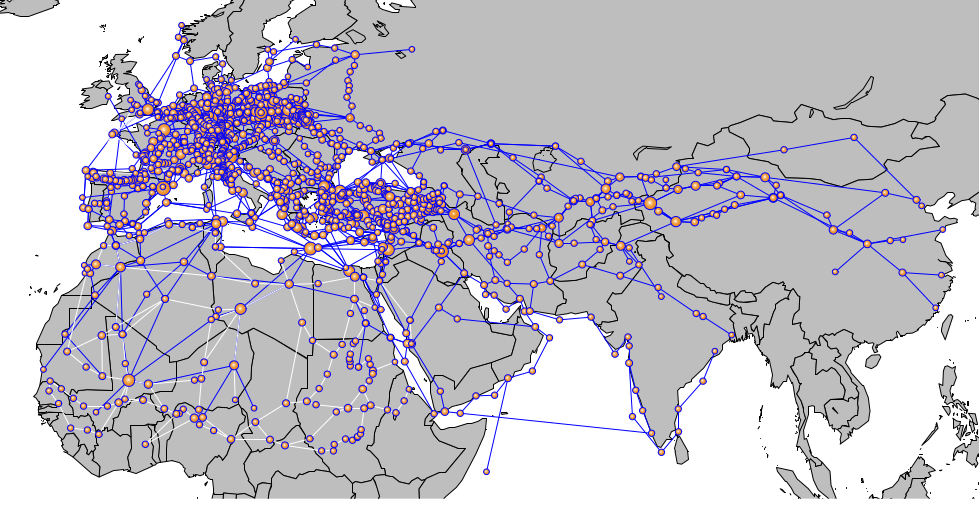

# Modeling Mortality and Transmission of the Black Plague
Adam Novotny, Apurva Raman

## Abstract:
Gómez and Verdú (GV) model the infection patterns of the Black Death pandemic [4]. They create a network of medieval cities and routes from the [OWTRAD (Old World Trade Routes) dataset][1], and model the transmission of the disease. They find that hub cities (those with high degree centrality) are infected more often, and compare the model's output to historical mortality data.


## Analysis of GV Paper:
GV create a network of medieval cities and connect them with trade and pilgrimage routes using historical data from the OWTRAD dataset.
They represent a city's infection state as a binary. At each step, an infected city has a probability of infecting each neighbor. Once a city has been infected it stays infected forever. A city may be infected multiple times, and GV tally the number of times each city gets infected. They start the model with a random city in Central Asia infected, and run it until a constant number of infection events have happened (6x the number of cities [seems to be arbitrarily chosen to ensure multiple infections]).

They plot historical mortality rates against centrality (degree, closeness, and clustering coefficient) to show that cities with high centrality tend to have higher mortality rates.




Figure 1: A geographical representation of the network. Created by Gómez and Verdú.


Then they plot the "Relationship between the network attributes of the cities and the probability of multiple infections" against the transmission probability. After multiple readings, I still have not figured out what these numbers (and their scale) even mean. All they show is that the advantage of being isolated is lowered when transmission is high. This makes intuitive sense, because as the p_t approaches 1 each city gets infected by its neighbors every step.

Finally, they propose that a possible reason that cities with high centrality have (historically) high mortality is that they had more chances of being reinfected. They speculate that “[t]he overall mortality rate will be the cumulative outcome of partial mortalities caused by each infection wave … [and] a city invaded multiple times could receive different pathogen strains.”

Ultimately, the simulation in the GV paper is quite simple. The only useful thing they do is aggregate historical mortality data and compare it to historical network attributes. Their simulation just adds complexity to an otherwise sound conclusion. The network is enough to show that the cities with high centrality have high mortality.

Had I been clear-headed when choosing a paper to replicate, I would have realized how unsuitable this paper was for a complexity science project, and would have had decided on something better.

## Replication:
We ran into a few problems when attempting to replicate the research paper.

First, we had trouble replicating the GV network. In the supplement, they list exact files from the OWTRAD dataset that they used, yet when we created the network from the listed files, the properties differed substantially. The table below compares our network characteristics with those reported by GV. After ruling out the most likely causes of the difference, we decided that the network we created from the OWTRAD dataset should be valid, and proceeded with the experiment.

#### Table of network characteristics (vs Gómez and Verdú):
| Characteristic | Our Network’s Value | Reported Value |
| --- | --- | --- |
| Number of Nodes | 1570 | 1311
| Number of Edges | 2069 | 2084
| Mean Degree | 2.63 | 3.18
| Mean Degree Trade | 2.05 | 2.49
| Mean Degree Pilgrimage| 0.59 |  0.69
| Transitivity | 0.065 | 0.098 |

The other issue we had was figuring out what "Relationship between the network attributes of the cities and the probability of multiple infections" means. The source code for GV simulation is in the "supplementary information," but the analysis code is not attached, and therefore we could not recreate their graphs.

We replicate their model, and also find a relationship between degree centrality and reinfection rates. We cannot compare the results quantitatively because the GV paper does not include these data.

## Modeling Mortality:
The GV model only represents a city's infection state as a binary, but then compares a second-order effect (sum of infection events) to mortality a percentage.

We add an SIR model in each city to analyze the effects of mortality on the transmission of the plague directly.

An SIR model is an epidemiological model for determining the number of people infected with a disease in a well mixed population. It has three states; Susceptible, Infected, Recovered. The susceptible population is not yet infected, but can become infected. At each timestep, susceptible people have a probability of transitioning to the infected state, which is determined by the fraction of infected in the population and the rate of infection. The third state in our model (Recovered) represents people who are dead, and cannot infect the susceptible population anymore.

In a traditional SIR model, a single infection will eventually spread through and kill the entire population. In the real world people in a city are not as well mixed, so outbreaks happen locally. There are many ways to model this behavior, for example by building a network of people within the city. We chose to add a state to the SIR model, "Not Yet Susceptible" (NYS), that a population can be in.

A city starts with the entire population in NYS, and a percentage of the population gets moved to S every time an city gets infected from a neighbor. This way, if a city gets infected once, the single outbreak will only be able to kill a portion of the population.


We give each city a population of 250 at the start of the simulation. At each timestep, the number of NYS, susceptible, infected, and dead residents is updated based on their respective rates and the number of infected people and the number of infections in each timestep.

```
From NYS to S = NYS * NYS_rate * infections_this_timestep
From S to I = I * I_rate
From I to D = D * D_rate
```

A city with infected residents may also transmit the disease to another city with a probability determined by transmission rate and the number of infected citizens.

```
Probability of transmission = T_rate * I
```

Cities can transmit disease to cities that are already infected, which converts people from NYS to S, and makes one more person in the city infected.

This SIR model keeps a percentage of the city alive until new infections make them susceptible. This reflects current knowledge of the epidemic by simulating infections spreading in different parts of the city, or multiple strains that infect different parts of the population [2][3].


## Validation:


Figure 2: Population in each state in the entire network

To validate that our model can accurately simulate disease spread though the network, we ran the model with a sweep of parameters and analyzed the results. Figure 2 shows global statistics for one set of parameters.

The number of not yet susceptible people drops rapidly as cities in the simulation get reinfected and the number of susceptible and infected people increases. As people start to die more frequently, the number of not yet susceptible people stabilizes since infection is slowing due to mortality.

This indicates that our modified SIR model is working as expected; the population transitions from state to state, and when mortality and infection rates are equal, mortality limits transmission. It also demonstrates that the entire population is not getting wiped out.

## Results
GV study the relationship between centrality and reinfections. Figure {}, shows the relationship between degree and number of reinfections. Reinfections increase proportionally with degree. This further confirms GV's conclusions that central cities were infected more often. Next, we analyze how changing disease parameters affects the outcomes.


Figure 4: Reinfections vs Degree


Figure 7: how modifying Mortality rate and Transmission rate affect reinfections vs degree

In Figure {} we plot degree vs. reinfections with different parameters for mortality and transmission rates. All graphs show a linear relationship between degree and number of reinfections. This shows that our conclusion is robust, i.e., it holds true for a wide range of input parameters.

Interestingly, when the mortality rate is high (top left), the relationship is less clear. In this case, the infected population dies in a few time steps, so their exposure to susceptible people and other cities is short. The effect is very similar to setting the transmission rate between cities low (bottom right).


## Interpretation
Ultimately, our extension added nothing substantial to the GV model other than making it much more complicated. The GV model shows that central cities are infected more often, and our model has the same property. We are able to show that our results are robust to a wide range of parameters, so at least our model is not overfitting. The extra complexity does generate much more data, but we do not have the analytical skills to discover any original results from it.

## References

[1]: http://ciolek.com/OWTRAD/DATA/oddda.html  "OWTRAD Dataset"

[2]: Morelli, G. et al. Yersinia pestis genome sequencing identifies patterns of global phylogenetic diversity. Nat. Genet. 42, 1140–1145
(2010).

[3]: Haensch, S. et al. Distinct clones of Yersinia pestis caused the Black Death. PLoS Pathog. 6, e1001134 (2010).

[4]: **Gómez, J. M. and Verdú, M.** "Network theory may explain the vulnerability of medieval human settlements to the Black Death pandemic." *Sci. Rep. 7*, 43467; doi: 10.1038/srep43467 (2017).

Gómez and Verdú use the Old World Trade Routes Dataset to construct a network model of Black Death transmission in human settlements at the time to determine what settlements were affected most by the pandemic. They use simulation and study the properties of the network from the dataset and use the results to observe infection patterns. They found that reinfection of central cities was instrumental in perpetuating the destruction of the plague. The summary data for each city is included in the supplementary information.

**Pastor-Satorras, R., & Vespignani, A.** "Immunization of complex networks." *Physical Review* E, 65(3), 036104 (2002).

Pastor-Satorras and Vespignani modeled disease spread over multiple networks. They show that a uniform random immunization strategy is not very efficient, and propose and analyze improved strategies for immunization. They found that scale-free networks are highly susceptible to epidemics, but discovered extremely effective strategies of immunization for it. They suggest that their model is relevant to the spreading of viruses over the internet, and propose a way to extend it to model STD transmission.

**Keeling, M. J., & Eames, K. T.** "Networks and epidemic models." *Journal of the Royal Society Interface*, 2(4), 295–307. 10.1098/rsif.2005.0051 (2005).

The authors provide an overview of the analogies between network attributes and epidemic characteristics. Rather than conducting a specific experiment, they explain the value of various models in simulating disease transmission. For example, they recommend scale-free networks constructed as described by Barabasi & Albert for creating models that account for super-spreaders.
